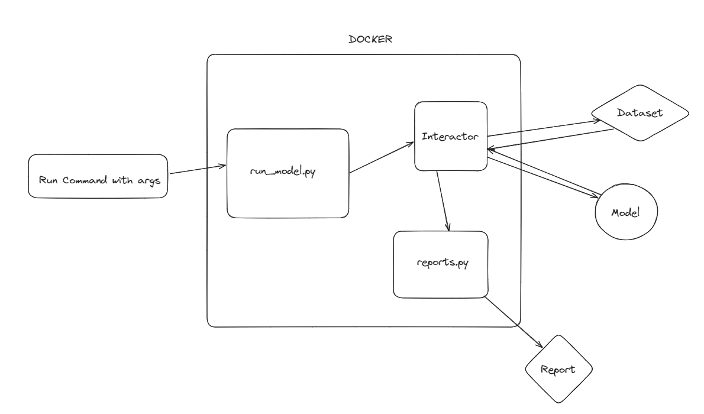

# BOTIST
Test framework to evaluate WER and Performance for different IA models and versions

## Main functioning:

Demo video here: [Screencast from 19-04-24 08:38:02.webm](https://github.com/rafanog5521/botist/assets/95366589/e240f7b9-7860-44a7-b689-cf59b103eb99)

## Setup (local)
- Put models on ./models folder
- Put datasets on ./datasets folder
- Set python virtual enviroment (optional)
  - python3 -m venv env
  - source ./env/bin/activate
- Run pip install -r ./requirements.txt
- Run export PYTHONPATH="${PYTHONPATH}:/yourfolders/botist/"
- ./src/run_model.py

## CUDA Docker support (to be setup only the first time)
- Set CUDA on your machine to run nvidia images on docker
  - Go to https://docs.nvidia.com/datacenter/cloud-native/container-toolkit/1.13.5/install-guide.html#setting-up-docker
- Run "docker context use default"
- You should be able to run with GPU support (if you have an NVIDIA card)
  

## Setup (docker, remote model/dataset)
- Check config/parameters.py if model and dataset are correct
- Run "make build_docker_model" build basic docker file and download dependencies for your model
- Run "make run_model" to run the model with your remote model/datasets

## Setup (docker, local model/dataset)
- Download model and/or dataset to a folder
- Check config/parameters.py if model and dataset are correct
- parameters.py model and dataset definition should match folder structure passed on CLI
  - Example: "home/user/Desktop/models/TinyLlama/TinyLlama-1.1B-Chat-v1.0" and "model_name = "TinyLlama/TinyLlama-1.1B-Chat-v1.0"" on the python file # 
  - Same applies for datasets
- Run "make build_docker_model m=model_path d=dataset_path" to build basic docker file and download dependencies for your model
- Run "make run_model m=model_path d=dataset_path" to run the model with your local model/datasets

## Measurements
## WER
There are currently 2 applications of this metric within the code:
  - 5 different inputs: To show average WER within different topics.
  - 1 input sent 5 times: To show WER consistency when the model receives a particular input several times.

## Performance
Performance metric is applied within the following contexts:
  - We measure the time that it takes the model to generate the first token.
  - Calculate the amount of tokens generated per second.

## Tools
Compare two reports (number of lines should be equal):
  - make compare_models PARAMS="--folders reports/2024-06-04_23-24-37_log reports/2024-06-05_11-50-30_log"

